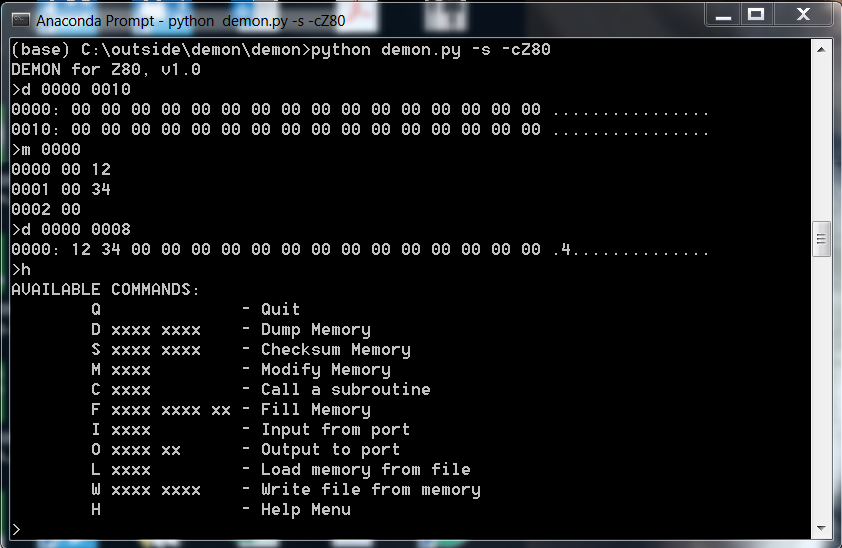
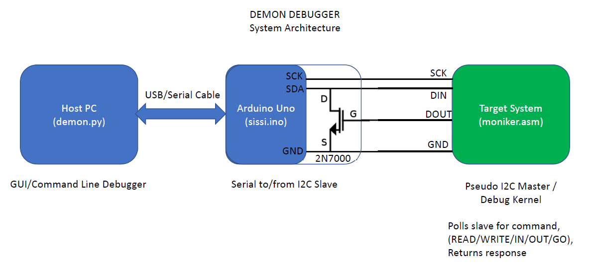

# demon debugger system - version 1.0 !

Debugger/Monitor for small "computers"

## Description:

This software can be used to add debug capabilities to an 8 or 16 bit machine, even if it doesn't have a serial console. It has been ported to Z80-based, 6502-based, and the CP1610-based systems.

In the normal configuration, you may have a system with no console, such as an arcade PCB. For example, I have used this system to repair a Sega Star Trek (Z80) and an Atari Asteroid (6502) machine.

The system must have a working CPU, and at least a small amount of ROM, RAM, and I/O.  The small kernel of code that runs on the system requires 2 output pins and 1 input pin to be available to the system. (I generally use the I/O lines for coin counters or dip switches, for example.)

Some minor modifications need to be done to the "moniker.asm" program to address the identified 3 I/O lines, and then the program is assembled, and the binary is placed into an EPROM and put into the system.

The three lines + ground are connected to an arduino-based adapter, which converts this communication standard to serial.

The USB/Serial is connected back to a PC running the demon.py command shell, which requires Python 3.0 and PySerial.

Now, if all goes well, you can use the console on the PC to access the memory space and I/O ports of the native system.

## How it Works:

The kernal of code on the native system is a modified I2C master, which polls the arduino at regular intervals for a handful of simple commands. Why an I2C master?  Because the target system is a master, the clock can go as slow as needed, as there are no timing requirements on the target system.

The Arduino acts as a Serial to I2C Slave bridge.  It is simply a standard Arduino Uno with one additional transistor, to convert the I2C bus from 2 signal lines to 3.  Why? Because it is much easier to identify unidirectional I/O lines than bidirectional ones.

## Alternate Configuration:

For systems that already have a Serial port, it is possible to bypass the entire I2C business, and connect directly to code on the native platform that speaks serial.  This was done on the Mattel Intellivision game console. Joe Zbiciak wrote a special cartridge image to do this, which runs on his excellent LTO Flash cartridge.

## Future:

1) I would like to port this to more systems, and/or help others fix their old things.  
2) The demon.py console is really quirky and primitive, I'd like to make full-fledged GUI at some point.

Please let me know if you need any help getting this system going, should you choose to use it!

