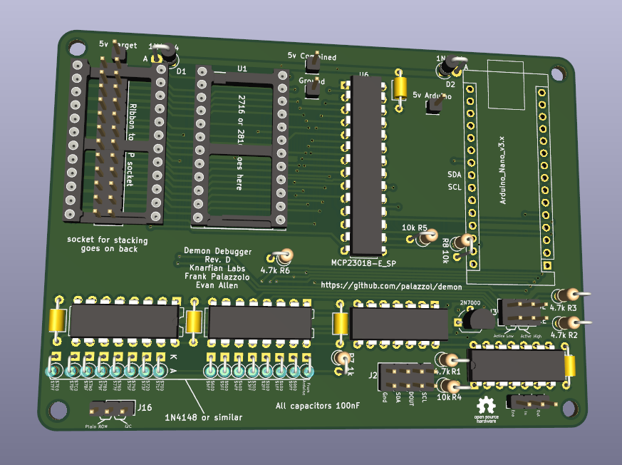
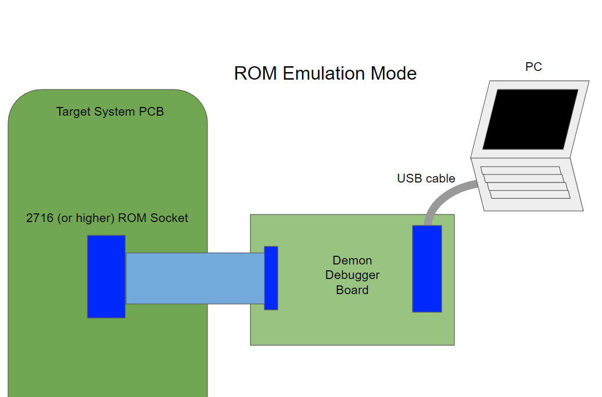
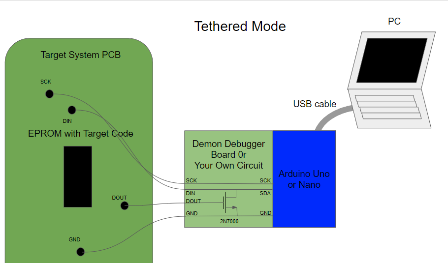

# Demon Debugger system - version 2.0 - coming soon!

Debugger/Monitor for small "computers"

## New in version 2.0

* No EPROM programmer needed!
* GUI client
* Python API for automating control of targets
* Modular target code minimized work for supporting new targets

## Description:

Demon Debugger is a tool that can be used to repair and reverse-engineer devices with 8 and 16 bit CPUs, such as arcade machines, console games, embedded computers, single board computers, etc.  It provides a debugging console, and so is especially useful for systems that lack a working one.

It has been ported to Z80-based, 6502-based, and the CP1610-based systems.  There are ports underway to other CPU architectures.

Unfortunately, Demon Debugger can't be used on a totally broken system.  The target system must have a working CPU, and at least a small amount of ROM and RAM.  However, we have found that for most applications, it's really not too hard to get a system to this point.

## How it Works:

In ROM emulation mode, The Demon Debugger board cable plugs into a socket on the target system, in place of a standard JEDEC ROM/EPROM chip.  Then, your PC can communicate with the target over serial, using a standard USB connection.

If your target system is already supported, there will be a target image already built, which you can download onto you target.  

To support a totally new target system, a small amount of tweaking may need to be done to the assembly code for your target. Generally, if you know the memory map for your system, this is really easy to do.

## Details

The Demon Debugger system has evolved over time.  If you have a Demon Debugger board, you can use ROM emulation mode with prebuilt target code, and get started right away, without any other tools.  If you need to support a new target, you can still use ROM emulation mode, once you build a new target code.

If you don't have a Demon Debugger board, you can still use the Demon Debugger system in Tethered mode, provided you have a few other capabilities.  It requires only an Arduino Nano/Uno, a single transistor, and the ability to program an EPROM chip.

## Currently Supported Targets

### 6502
* Generic 6502 (Works on most targets) - Atari Asteroids, VCFMW Badge!
* Atari Asteroid Arcade, tethered mode
* Atari Starship 1 Arcade

### Z80
* Z80 reference code (Tweakable to work on most targets)
* Sega Star Trek Arcade
* Sega Star Trek Arcade, tethered mode
* Bally Midway Gorf Arcade 
* Bally Astrocade, cartridge
* Colecovision/Bit90, cartridge
* Universal Space Raider Arcade

### CP1610
* Mattel Intellivision - via LTO Flash cartridge*

### Other - coming soon
* Heathkit ET-4300A (6800 target)
* Heathkit ET-4300A + 6809 adapter (6809 target)
* Mattel Intellivision, cartridge (CP1610 target)
* TI 99/4A cartridge (TMS9900 target)
* OS816 SBC (65C816 target)
* MicroProfessor-1 (Z80 trainer)
* Various 8080 targets
* Atari 2600 (6502)
* etc.

## Old Videos

Tethered Mode - [Sega Sound Board test](https://www.youtube.com/watch?v=uYlbb8uPjoU) Quality is not very good, but the Arduino module is next to the laptop

[Intellivision Demo](https://www.youtube.com/watch?v=_8YfCMpHLhY) Better quality, no Arduino needed using native serialport on the LTO Flash cart.

## Future:

I would like to port this to more systems, and/or help others fix their old things.  
Please let us know if you need any help getting this system going, should you choose to use it!
